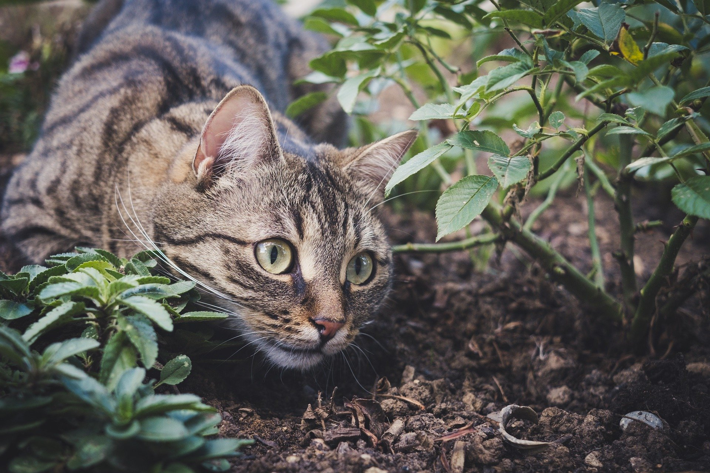

# Outdoor Cats 
### The Cutest Ecological Menace on Earth. 
#### How Do We Fix This?

<iframe width="640" height="360" src="https://www.youtube.com/embed/Q0jpD0BHgwQ" frameborder="0" allow="accelerometer; autoplay; clipboard-write; encrypted-media; gyroscope; picture-in-picture" allowfullscreen></iframe>

### The Problem

  Outdoor housecats are a common sight in cities and suburbs throughout the United States. We like to allow our feline friends the freedom to do as they wish. Cats are solitary and independent animals, so it only makes sense that we let them roam freely; trusting, of course, they come back to eat.

Unfortunately, despite our best intention, by introducing our feline companions to an entirely unprepared ecosystem, we have allowed a major ecological catastrophy to unfold. For more details the environmental impact of outdoor cats, please click [here](https://skippyj.github.io/cats-and-ecology/the_problem)

### It isn't just feral cats
  When it comes to predation, there isn't much difference between a domesticated cat roaming freely outdoors and a feral cat with no definite home. Cats are predators by nature and will hunt for more than just sustenance. Beyond that, un-neutered outdoor cats (whether or not they are feral) inevitibly contribute to a growing feral cat population.

### Rectification Attempts
  In order to design and propse an adequate solution, first we have to know what ongoing attempts at remediation have been, or are being undertaken.

#### Trap and Return (TNR)
  By far the most common approach to our ecological delimma, TNR is a very simple (and comparatively ethical) solution to reduce feral cat population. As the name would suggest, TNR projects seek to trap outdoor cats (usually feral, sometimes domestic), neuter/spay them, and either return them back to the "suburban wild," or house them in local animal shelters to await adoption. Unfortunately, this approach is only as effective as its implementation. According to [a study published by the University of California Davis](https://skippyj.github.io/cats-and-ecology/sources), TNR projects tend to lack effectiveness across the board, due to poor implementation and ill-defined goals. Additionally, TNR projects keep very poor record of their own effectiveness, leading to insufficient data.

For more information about TNR, visit [alleycat.org](https://www.alleycat.org/resources/how-to-help-community-cats-a-step-by-step-guide-to-trap-neuter-return/)

#### Poison Baiting and Hunting
  As inhumane as it may seem, many communities around the world have resorted to poison baiting. For example, [according to the government of Australia](https://www.environment.gov.au/biodiversity/invasive-species/feral-animals-australia/feral-cats), feral cats have been allowed to cause so much damage, that they are now officially declared invasive pests. It goes without saying that once an animal is declared a pest, all bets are off in regards to the expectation of ethical or humane treatment. By their very nature, both huting and (especially) poison baiting, are incredibly effective means of controling an otherwise out-of-control cat population. Ultimately, by virtue of our inaction, we have necessitated hostile and inhumane intervention in order to mitigate the damaged caused by our negligent introduction of such a predacious species.

### The Time to Act is Now
  If you love cats like I do, you should be very upset after reading the previous section. Not at the government of Australia (or any other government with similar policies for that matter), but at our own mistakes that lead to the necessity of decimating one population to save another. 

#### Educate Your Community!
  Ultimately, while it may be a noble goal to board a plane to a major city where cats roam freely, it is far more reasonable to address this problem in your local community. First, I believe education is critical to resolve this problem. According to [[SURVEY_DATA_TBD]], approximately [[SURVEY_DATA_TBD]] of cat owners were entirely unaware of the environmental concequences of free-roaming cats. Many (I would wager _most_) pet owners are also animal lovers in a general sense; if they knew the harm that outdoor cats cause on other wildlife, they would definitely think twice before letting Mittens roam freely.

#### Get Involved!
  Have you ever been sitting outside or looking out the window, only to see a stray cat saunter freely down the street? It may not necessarily be safe to approach the cat, but that doesn't mean you should ignore it. Take out a pen and paper and write down what you saw - what color, how big was it, did it have a collar, etc. If you've seen it more than once, try and write down the time of day and where it was. This information will be invalueble to local shelters, as they typically have the eqipment to safely catch the roaming feline and, depending on who owns it, either spay/neuter it or return it to its owner. 

#### Don't Be Part of the Problem; Be Part of the Solution!
- Spay and neuter your cats. Even if you don't have a free-roaming cat, it is important to spay/neuter them. Should they ever get out, it only takes one chance meeting with another cat to increase the outdoor population ten-fold
- If you want your cat to spend time outdoors, consider putting together a small, fenced-in area for them to play freely while still remaining contained. Not only does this decrease the risk of them acting on their predatory nature, but it also reduces the likelyhood that they will suffer due to man-made environmental hazards (ex: cars and trucks). 
 
## Sources
[Click me to view sources!](https://skippyj.github.io/cats-and-ecology/sources)
